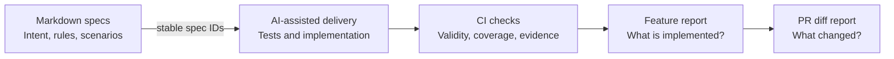
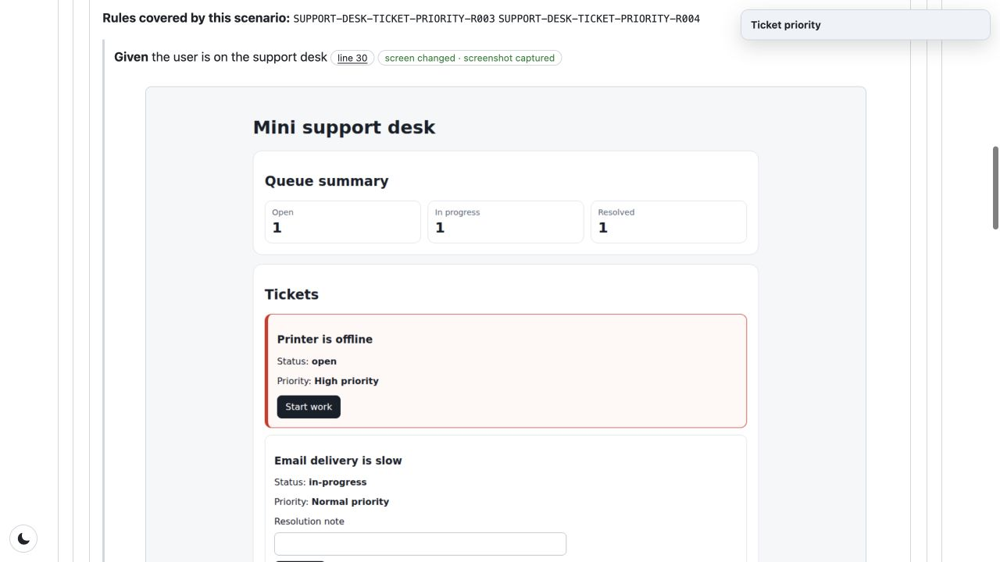
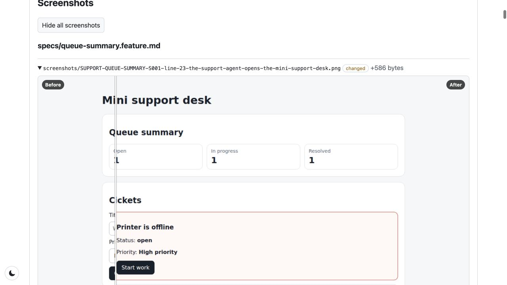

# feature-spec-md

**Give AI a product contract it can implement—and give reviewers proof they can trust.**

`feature-spec-md` is the accountability layer between a Markdown plan and AI-written code. It keeps product intent readable, connects every rule and scenario to executable tests through stable IDs, and turns the result into reports that answer two simple questions: **what is implemented?** and **what changed in this PR?**

It does not replace Markdown, your test runner, or CI. It connects them.



The specs can cover the shared model, user-facing features, technical stack, and design direction. Tests keep using the tools you already have—Playwright, Vitest, Node test, or another runner—and only need to reference the relevant IDs.

## Why it clicks

Without a durable link between the plan and the code, an AI can produce a plausible implementation while people still have to reconstruct whether it meets the intent. `feature-spec-md` makes that link explicit:

1. **Write the contract in ordinary Markdown.** Capture vocabulary, rules, scenarios, technical choices, and design intent in small reviewable documents.
2. **Let AI turn the contract into tests and code.** Stable IDs such as `TICKET-CREATION-S001` travel from the spec into test titles, annotations, or comments.
3. **Let CI verify the connection.** Validation catches malformed specs and broken references; coverage shows which model items, rules, and scenarios have executable tests; evidence policy says where screenshots are required.
4. **Review the result, not the conversation that produced it.** The feature report joins intent, coverage, source links, and browser evidence. The PR diff report isolates changed spec text and before/after screenshots.

That means a reviewer can move from **rule → scenario → test → screenshot** without guessing, and a team can change AI models or start a fresh chat without losing the product contract.

## See one feature move through the loop

The demo project makes high-priority tickets visually distinct in [one real pull request](https://github.com/anselmdk/feature-spec-md-demo/pull/24): the branch updates the feature and design specs, executable tests reference their IDs, CI publishes the complete implementation report, and the diff report shows exactly what changed against `main`.

- [Open the demo app repository](https://github.com/anselmdk/feature-spec-md-demo)
- [Browse the latest demo report](https://feature-spec-md.anselm.dk/demo/latest/)
- [Open the complete feature report](https://feature-spec-md.anselm.dk/demo/build/299/)
- [Open the PR diff report](https://feature-spec-md.anselm.dk/demo/pr/24/299/)
- [Browse the latest library-owned mock reports](https://feature-spec-md.anselm.dk/mocks/latest/)

### The feature report: intent and proof in one place

Rules show their covering scenario and test source. A browser scenario shows its Given/When/Then steps, the exact spec lines, evidence status, and the screenshot captured by the test.

[](https://feature-spec-md.anselm.dk/demo/build/299/#support-desk-ticket-priority-s001)

_Click the screenshot to explore the live report._

### The PR diff report: review behavior, not just files

The PR report compares two published builds. It shows changed Markdown contract text and puts before/after browser evidence in an interactive comparison slider, so visual side effects are visible even when the feature did not directly touch that scenario.

[](https://feature-spec-md.anselm.dk/demo/pr/24/299/)

_Click the screenshot to explore the live diff report._

## What you get

- **One source of intent:** plain Markdown documents for the domain model, product features, technical stack, and UI/design direction.
- **Traceability without a custom test runner:** stable IDs connect model items, rules, and scenarios to ordinary test source.
- **Fast feedback:** validation checks structure and references, while coverage identifies exactly what has and has not been implemented by tests.
- **Evidence by policy:** each feature or scenario can require unit, integration, Playwright, manual, or no executable testing—and can require screenshot evidence for UI flows.
- **A reviewable system view:** HTML reports combine the rendered specs, coverage, validation state, source links, GitHub/build metadata, and screenshots.
- **A focused PR view:** diff reports highlight changed spec sections and compare screenshot evidence between the base and current builds.
- **CI-ready publishing:** GitHub Actions helpers publish immutable build reports, stable latest reports, PR diff reports, job summaries, and PR comments.
- **A library API:** projects can parse specs, check coverage, collect screenshots, and render reports from their own tooling.

## Demo project

The complete [`feature-spec-md-demo`](https://github.com/anselmdk/feature-spec-md-demo) is a small support-ticket desk with model, feature, stack, and design specs; unit and Playwright tests; screenshot evidence; and the full GitHub Actions publishing flow. Use it as a copyable reference for project structure, scripts, test helpers, and CI configuration.

The package itself also publishes [deterministic mock reports](https://feature-spec-md.anselm.dk/mocks/latest/) that exercise covered and missing states, report layers, metadata, changed spec text, and screenshot comparisons.

## What you write

Use four ordinary Markdown document types:

```txt
*.model.md    shared domain vocabulary
*.feature.md  user-facing behavior, rules, and scenarios
*.stack.md    technical platform choices
*.design.md   product, UI, and interaction direction
```

Each document has frontmatter, a short `## Purpose`, and stable IDs.

### Model specs

Model specs define the shared vocabulary that features can refer to. Use them for domain concepts, states, entities, and important business terms.

```md
### ACCOUNT-M001: Registered person

A person who has completed registration and can request sign-in links.
```

### Feature specs

Feature specs describe user-facing behavior with rules and scenarios. Rules and scenarios get stable IDs that tests can reference. Scenario steps are fenced so Markdown previews preserve line breaks without relying on trailing spaces.

````md
---
id: ACCOUNT-ACCESS
title: Account access
test: playwright
screenshots: required
---

# Account access

## Purpose

Allow registered people to access their account securely.

## Rules

- ACCOUNT-ACCESS-R001: Sign-in links MUST expire.

## Scenarios

### ACCOUNT-ACCESS-S001: Registered person signs in

```
Given a registered person is on the sign-in page
When they request and open a valid sign-in link
Then they are signed in
```
````

Feature specs can declare the expected test and evidence policy:

```txt
test: unit | integration | playwright | manual | skip
screenshots: required | optional | skip
```

If `screenshots` is omitted, Playwright scenarios default to `required`; non-Playwright scenarios default to `skip`. Scenario-level overrides can be written directly below a scenario heading, before the fenced scenario block:

````md
### ACCOUNT-ACCESS-S002: Link expiry is calculated

Test: unit
Screenshots: skip

```
Given a sign-in link was created 31 minutes ago
When expiry is calculated
Then the link is expired
```
````

See [SPEC_FORMAT.md](SPEC_FORMAT.md) and [docs/evidence-policy.md](docs/evidence-policy.md) for the exact format.

### Stack specs

Stack specs document technical decisions that shape the implementation: framework, storage, test runner, deployment constraints, external services, or architecture decisions.

### Design specs

Design specs capture product, UI, and interaction direction: layout priorities, states, accessibility expectations, empty states, or copy tone.

## How tests connect to specs

Tests reference spec IDs in titles, tags, annotations, comments, or metadata. The tool scans test files and matches those references back to the Markdown documents.

```ts
test("ACCOUNT-ACCESS-S001 registered person signs in", async ({ page }) => {
  // Covers ACCOUNT-ACCESS-R001 and ACCOUNT-M001.
});
```

This keeps the test runner independent from `feature-spec-md`. You can use Playwright, Vitest, Node test, or another runner as long as the source files contain the relevant IDs.

## Install

```bash
npm install -D @anselmdk/feature-spec-md
```

Create starter specs:

```bash
npx feature-spec-md init --kind model --dir specs
npx feature-spec-md init --kind feature --dir specs
npx feature-spec-md init --kind stack --dir specs
npx feature-spec-md init --kind design --dir specs
```

## Workflow

1. Ask an AI to draft or update `*.model.md`, `*.feature.md`, `*.stack.md`, and `*.design.md` files.
2. Declare each feature/scenario test evidence policy where the default is not right.
3. Run `npx feature-spec-md check` until the spec set is valid.
4. Ask an AI to write executable tests from the specs, preserving the relevant `-M001`, `-R001`, and `-S001` IDs in the test source.
5. Run `npx feature-spec-md coverage` to see which scenarios, rules, and model items have tests.
6. Run `npx feature-spec-md report` to generate an HTML implementation report for review or CI artifacts.
7. Use `npx feature-spec-md github-report` in GitHub Actions when the report should be linked from the job summary, uploaded as an artifact, or published by FTP.
8. Use `npx feature-spec-md github-diff-report` in PR builds when a published diff should compare the current report output and screenshots with a base build and provide a PR comment body.

The longer flow, including AI prompts and CI setup, is in [docs/spec-driven-flow.md](docs/spec-driven-flow.md). The demo repository also shows the flow in practice: <https://github.com/anselmdk/feature-spec-md-demo>.

## CLI tools

```bash
npx feature-spec-md check
npx feature-spec-md coverage --fail-on-missing
npx feature-spec-md report --out test-results/spec-report/index.html
npx feature-spec-md github-report --report-dir test-results/spec-report --publish ftp
npx feature-spec-md github-diff-report --publish ftp --pr-number 123
```

By default the CLI scans:

```txt
specs/**/*.model.md
specs/**/*.feature.md
specs/**/*.stack.md
specs/**/*.design.md
tests/**/*.ts
```

Use explicit patterns when your project uses different paths:

```bash
npx feature-spec-md check \
  --specs "product/**/*.model.md,product/**/*.feature.md,product/**/*.stack.md,product/**/*.design.md" \
  --tests "e2e/**/*.spec.ts"
```

### `check`

Validates the spec set and, by default, requires model, rule, and scenario coverage when tests are scanned.

```bash
npx feature-spec-md check
```

`check` validates spec structure, references between documents, and test coverage. Use `--require-scenario-coverage=false`, `--require-rule-coverage=false`, or `--require-model-coverage=false` while drafting.

### `coverage`

Prints a terminal implementation report showing covered and missing model items, rules, and scenarios.

```bash
npx feature-spec-md coverage --fail-on-missing
```

Use `--fail-on-missing=false` when missing model item, rule, or scenario coverage should not fail CI.

### `report`

Writes an HTML report for local review, CI artifacts, or publishing.

```bash
npx feature-spec-md report \
  --tests "tests/**/*.ts" \
  --out test-results/spec-report/index.html
```

The report can include screenshot evidence from Playwright or another test runner by passing one or more screenshot manifest files:

```bash
npx feature-spec-md report \
  --screenshots "test-results/spec-report/screenshots-*.json"
```

When CI should fail for missing declared screenshot evidence, use `--enforce-evidence`:

```bash
npx feature-spec-md report \
  --screenshots "test-results/spec-report/screenshots-*.json" \
  --enforce-evidence \
  --out test-results/spec-report/index.html
```

This gate only fails for scenarios whose resolved screenshot policy is `required`. In GitHub Actions, the report also includes source links and report metadata derived from the repository, ref, SHA, run, build number, and pull request context when available.

Reports include a persistent moon/sun light/dark theme toggle in the lower-left
corner. Screenshot evidence is clickable and opens at its native size in a
scrollable full-screen viewer. PR diff reports keep before and after images side
by side, with red and green borders respectively.

Projects can group model, stack, design, and feature documents into collapsible
report layers. Add a `layer` to each document's frontmatter and define the
ordered layer catalogue in `package.json`:

```json
{
  "featureSpecMd": {
    "report": {
      "layers": [
        {
          "id": "context",
          "title": "Context",
          "description": "Architecture, design, and domain vocabulary"
        },
        {
          "id": "capability",
          "title": "Capabilities",
          "description": "Authoritative business behavior"
        },
        {
          "id": "surface",
          "title": "Delivery surfaces",
          "description": "Applications, hosting, and documentation"
        },
        {
          "id": "journey",
          "title": "Journeys",
          "description": "Cross-system release paths"
        }
      ],
      "layersDefaultOpen": false,
      "documentsDefaultOpen": false
    }
  }
}
```

When layers are configured, unassigned documents remain visible in an `Other`
layer and produce a warning; unknown layer ids are errors. Deep links open all
containing layers and documents automatically. Layers start open unless the
project sets `layersDefaultOpen` to `false`. A fixed report navigator follows
the reader's current layer or document. Its layer and document controls directly
toggle the corresponding report sections, and feature documents include a
separate control for opening or closing all their scenarios. It collapses into a
compact floating control on narrower screens. Projects without layer
configuration retain the flat report layout.

### `github-report`

Writes a GitHub Actions job summary and prepares the generated report for either artifact upload or FTP publishing.

```bash
npx feature-spec-md github-report \
  --report-dir test-results/spec-report \
  --publish ftp
```

With FTP publishing, build reports are published below a `build/<build-number>/`
directory. This keeps immutable build outputs available for later PR diff
comparisons. The same report is also published to `latest/`, providing a stable
URL suitable for README links and bookmarks. The action exposes both
`report-url` for the immutable build and `latest-report-url` for the stable
alias. The reusable CI workflow updates this alias only for a push to the
repository's default branch, so pull requests and other branch builds cannot
replace the public latest report.

### `github-diff-report`

Builds and publishes a PR diff report from already-published feature spec report outputs.

```bash
npx feature-spec-md github-diff-report \
  --publish ftp \
  --pr-number 123
```

The diff report lists changed report assets, extracts changed spec sections,
groups configured projects by layer and screenshot changes by spec/scenario, writes a GitHub Actions summary,
and exposes a `diff-comment-body` output. The reusable PR workflow maintains
one compact PR comment linking to the latest full spec report and diff report.
Earlier build links remain available in a collapsed history below the current
links. PR diff reports are published below `pr/<pr-number>/<build-number>/`.

## Playwright screenshot evidence

The package exports a Playwright helper from `@anselmdk/feature-spec-md/playwright`. It maps scenario step text back to the spec line, wraps the implementation in a Playwright `test.step`, captures a screenshot after the step, attaches it to the test, and writes a screenshot manifest such as `test-results/spec-report/screenshots-0.json`.

That manifest can then be passed to `feature-spec-md report` with `--screenshots "test-results/spec-report/screenshots-*.json"` so the HTML report can show scenario evidence next to the relevant spec step. With `--enforce-evidence`, missing screenshots fail only for scenarios declared as `screenshots: required`.

## GitHub Actions report publishing

`feature-spec-md github-report` writes the GitHub Actions job summary and can either prepare outputs for a GitHub artifact upload or publish the generated report to FTP. `feature-spec-md github-diff-report` compares published build reports and publishes a PR-specific diff report.

For FTP publishing, configure repository secrets in GitHub under **Settings → Secrets and variables → Actions → Repository secrets**.

Required secrets or environment variables:

```txt
FEATURE_SPEC_FTP_HOST=ftp.example.com
FEATURE_SPEC_FTP_USER=feature-spec-md
FEATURE_SPEC_FTP_PASSWORD=<your FTP password>
FEATURE_SPEC_REPORT_BASE_URL=http://feature-spec-md.anselm.dk/
```

Optional values:

```txt
FEATURE_SPEC_FTP_REMOTE_DIR=/public_html/feature-spec-md
FEATURE_SPEC_FTP_PORT=21
FEATURE_SPEC_FTP_SECURE=false
FEATURE_SPEC_BUILD_NUMBER=<build number, defaults to GITHUB_RUN_NUMBER>
FEATURE_SPEC_PR_NUMBER=<pull request number>
FEATURE_SPEC_BASE_BUILD_NUMBER=<main/base build number for PR diffs>
```

Example GitHub Actions step for publishing the current report:

```yaml
- name: Publish feature spec report
  if: always() && hashFiles('test-results/spec-report/index.html') != ''
  run: npx feature-spec-md github-report --publish ftp --report-dir test-results/spec-report
  env:
    FEATURE_SPEC_FTP_HOST: ${{ secrets.FEATURE_SPEC_FTP_HOST }}
    FEATURE_SPEC_FTP_USER: ${{ secrets.FEATURE_SPEC_FTP_USER }}
    FEATURE_SPEC_FTP_PASSWORD: ${{ secrets.FEATURE_SPEC_FTP_PASSWORD }}
    FEATURE_SPEC_REPORT_BASE_URL: ${{ secrets.FEATURE_SPEC_REPORT_BASE_URL }}
```

Example step for publishing a PR diff after the current report has been published:

```yaml
- name: Publish feature spec PR diff
  if: always() && github.event_name == 'pull_request'
  run: npx feature-spec-md github-diff-report --publish ftp --pr-number "${{ github.event.pull_request.number }}"
  env:
    FEATURE_SPEC_FTP_HOST: ${{ secrets.FEATURE_SPEC_FTP_HOST }}
    FEATURE_SPEC_FTP_USER: ${{ secrets.FEATURE_SPEC_FTP_USER }}
    FEATURE_SPEC_FTP_PASSWORD: ${{ secrets.FEATURE_SPEC_FTP_PASSWORD }}
    FEATURE_SPEC_REPORT_BASE_URL: ${{ secrets.FEATURE_SPEC_REPORT_BASE_URL }}
```

## Library API

Most integrations can use the top-level document API:

```ts
import {
  checkSpecDocuments,
  collectSpecScreenshots,
  parseSpecDocument,
  renderHtmlReport,
  renderLocalDiffReport,
  validateScenarioScreenshots,
  validateSpecDocument,
} from "@anselmdk/feature-spec-md";
```

Useful exports include:

- `parseSpecDocument` and kind-specific parsers for reading Markdown specs.
- `validateSpecDocument` and `validateSpecGraph` for checking one document or a connected spec set.
- `checkSpecDocuments` for loading specs and tests, validating documents, and computing coverage in one call.
- `buildSpecCoverageSummary` and `collectSpecTestReferences` for custom coverage workflows.
- `collectSpecScreenshots` and `validateScenarioScreenshots` for loading and enforcing screenshot evidence.
- `renderHtmlReport` for generating the same report UI from your own integration.
- `renderLocalDiffReport` for generating the same diff-report UI from local report directories.
- `insertReportMetadata` and `githubReportMetadata` for adding source/build/PR metadata to reports.
- `writeTextFile` for small report-writing integrations.

Feature-only helpers such as `parseFeatureSpec` and `checkFeatureSpecs` remain available for compatibility.

The package also exports `@anselmdk/feature-spec-md/specDocuments` and `@anselmdk/feature-spec-md/playwright` for more focused imports.

## Development

```bash
npm install
npm test
npm run typecheck
npm run build
```

## Releases

Release candidates and stable releases are documented in [docs/releasing.md](docs/releasing.md).
