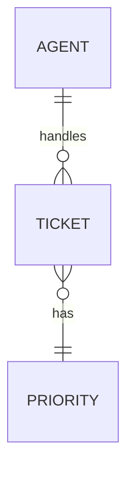

# Support desk

## Purpose

Define the shared vocabulary for a small customer support workflow.

## Model

### SUPPORT-M001: Ticket

A customer request that needs a response from an agent.

### SUPPORT-M002: Agent

A team member who reviews tickets and sends replies.

### SUPPORT-M003: Priority

A visible urgency label used to sort the queue.

## Rules

- SUPPORT-M-R001: Tickets keep a stable public reference.

## Model Diagram

## Open Questions

- SUPPORT-Q001: Should permission tables have optional coverage checks later?

## Assumptions

- SUPPORT-A001: Review notes are shown in reports as informational context.

## Permissions

- Agents can view assigned tickets.
- Leads can reassign tickets.
